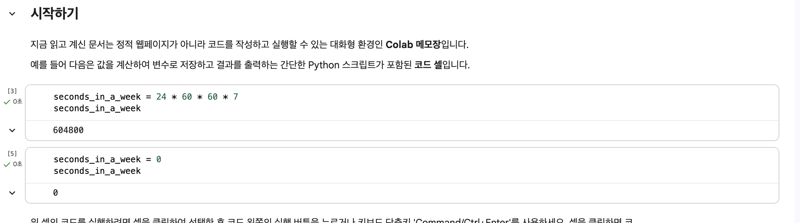
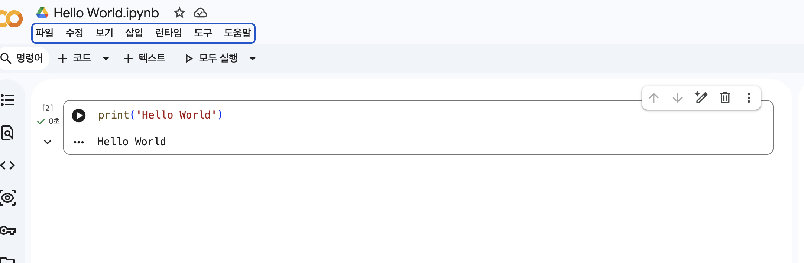
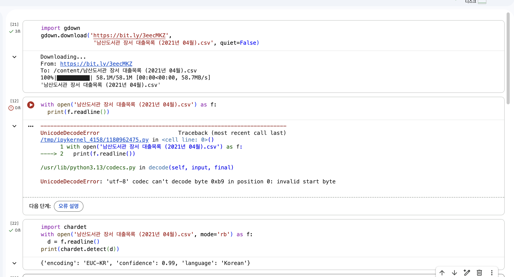
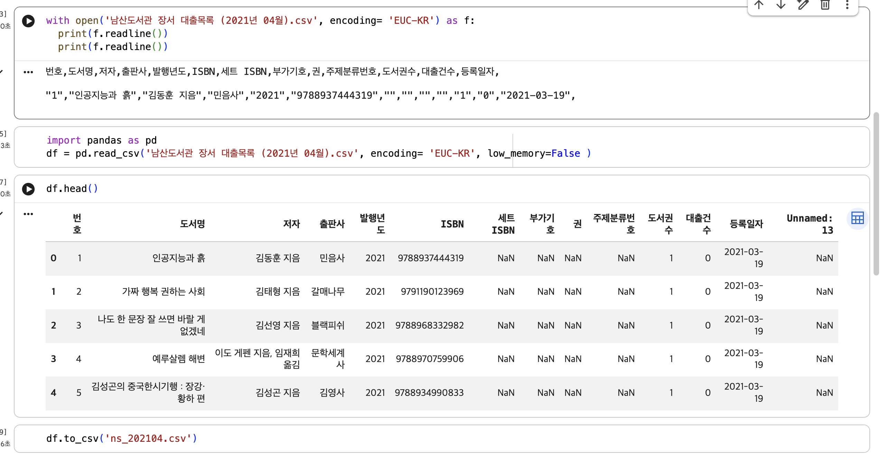
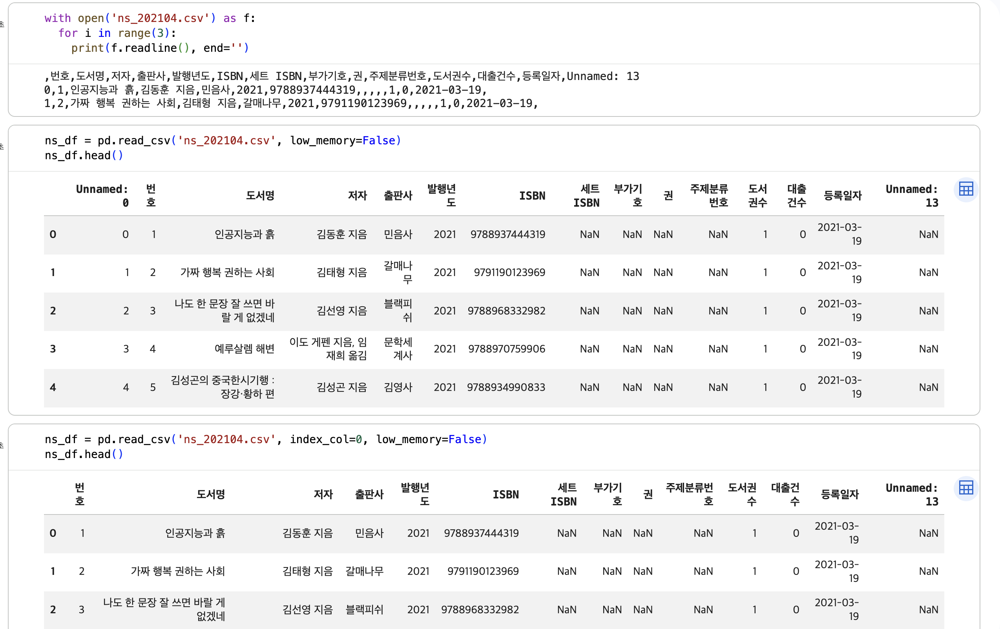
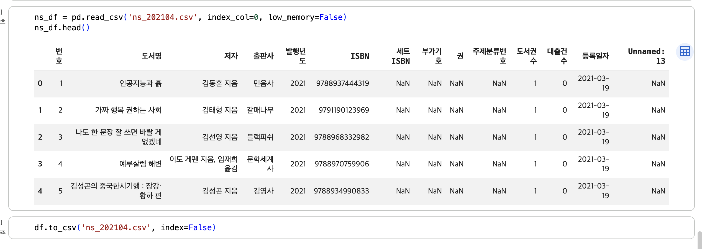

# 데이터분석 1주차 정규과제

📌데이터분석 정규과제는 매주 정해진 분량의 『*혼자 공부하는 데이터 분석 with 파이썬*』 을 읽고 학습하는 것입니다. 이번 주는 아래의 **DataAnalysis_1st_TIL**에 나열된 분량을 읽고 공부하시면 됩니다.

아래의 문제를 풀어보며 학습 내용을 점검하세요. 문제를 해결하는 과정에서 개념을 스스로 정리하고, 필요한 경우 제시된 강의를 참고하여 보완하는 것이 좋습니다.

<!-- 강의 링크는 아래와 같습니다.
https://www.youtube.com/watch?v=qGE_rT_oQaQ&list=PLVsNizTWUw7FGzSRCkQrPEEe-ljVXgS7k
https://www.youtube.com/watch?v=tp9XmeaHU0E&list=PLVsNizTWUw7FGzSRCkQrPEEe-ljVXgS7k&index=2
https://www.youtube.com/watch?v=D46j-e_IHlI&list=PLVsNizTWUw7FGzSRCkQrPEEe-ljVXgS7k&index=3
-->


## DataAnalysis_1st_TIL

### 1장 데이터 분석을 시작하며
#### 01. 데이터 분석이란
#### 02. 구글 코랩과 주피터 노트북
#### 03. 이 도서가 얼마나 인기가 좋을까요?


## Study Schedule

| 주차  | 공부 범위     | 완료 여부 |
| ----- | ------------- | --------- |
| 1주차 | p.24~81    | ✅         |
| 2주차 | p.84~151   | 🍽️         |
| 3주차 | p.154~219  | 🍽️         |
| 4주차 | p.222~279 | 🍽️         |
| 5주차 | p.282~325 | 🍽️         |
| 6주차 | p.328~379 | 🍽️         |
| 7주차 | p.382~430 | 🍽️         |

<br>

<!-- 여기까진 그대로 둬 주세요-->


# 1️⃣ 개념 정리 

## 01. 데이터 분석이란
### 데이터 분석
- 유용한 정보를 발견하고 결론을 유추하거나, 의사 결정을 돕기 위해 데이터를 조사, 정제, 변환, 모델링하는 과정
- 다양한 접근 방법/형태로 여러 분야에서 사용
- 비즈니스 결정을 과학적을 내리기 위한 도구로 사용
- <통계적 관점> 기술통계, 탐색적 데이터 분석, 가설검정으로 나눌 수 있음.
- (넓은 의미 : (좁은 의미 : 기술통계, 탐색적 데이터 분석, 가설검정) + 데이터 수집, 데이터 처리, 데이터 정제, 모델링)

### 데이터 과학
- 통계학, 머신러닝, 데이 분석, 데이터 마이닝
- 데이터 분석에 비해 머신러닝 모델을 만들어 문제를 해결하는 데 비중을 둠

### 데이터 분석과 데이터 과학의 차이점
| 특징 | 데이터 분석 | 데이터 과학 |
|---|---|---|
| 범주 | 비교적 소규모 | 대규모 |
| 목표⭐️ | 의사 결정을 돕기 위한 통찰을 제공하는 일 | 문제 해결을 위해 최선의 솔루션을 만드는 일 |
| 주요 기술 | 컴퓨터 과학, 통계학, 시각화 등 | 컴퓨터 과학, 통계학, 머신러닝, 인공지능 등 |
| 빅데이터 | 사용 | 사용 |

### 데이터 분석을 위한 도구
- 프로그래밍 언어 -> 분석 도구
#### 프로그래밍 언어 
- 파이썬과 R
- 데이터가 데이터베이스 형태로 있는 경우 -> SQL 사용 가능.
#### 프로그래밍 환경 : 구글 코랩
#### 파이썬 필수 패키지
- 넘파이, 판다스, 맷플롯립, 사이파이
<!-- 새롭게 배운 내용을 자유롭게 정리해주세요.-->


## 02. 구글 코랩과 주피터 노트북
### 구글 코랩, 주피터 노트북
- 구글 코랩 : 구글이 주피터 노트북을 커스터마이징한 것. 
| 특징 | 구글 코랩 | 주피터 노트북 |
|---|---|---|
| 설치 | 클라우드 기반이므로 설치 불필요 | 내 컴퓨터에 설치 |
| 실행 환경 | 인터넷이 연결된 웹 브라우저 | 오프라인 상태의 웹 브라우저 |
| 파일 저장 | 구글 드라이브에 자동 저장 | 내 컴퓨터 하드 디스크에 저장 |
| 패키지 | 사전 설치되어 제공 | 패키지 관리자로 직접 설치 |

### 구글 코랩
#### 셀
- 셀 : 코럅에서 실행할 수 있는 최소 단위
- 택스트 셀 : 코드처럼 실행되는 것이 아니기 떄문에 자유롭게 사용 가능. HTML(마크업)과 마크다운 혼용 사용 가능
- 코드 셀 : 파이썬 코드를 입력하고 실행할 수 있는 셀. ctrl(command) + Enter 시 실행
#### 런타임
- 런타임 : 파이썬 코드는 구글 클라우드에서 제공하는 가상 서버에서 실행
- 끊어지는 경우, 다시 연결 버튼을 클릭하여 모든 코든 셀 다시 실행
#### 단축 키
- 코드 셀 실행 : Ctrl(Command) + Enter
- 다음 셀로 포커스 이동 : Shift + Enter
- 코드 셀 실행 + 새로운 코드 셀 추가 : Alt(Option) + Enter
- 내 구글 드라이브에 저장 : Ctrl(Command) + S
#### 노트북 
- 코랩의 프로그램 작성 파일
- 오른쪽에 있는 RAM, 디스크 아이콘에 마우스 커서 올리면 런타임 정보 확인 가능
- 코랩 노트북에서 사용할 수 있는 구글 클라우드의 가상 서버 최대 5개. 한 개의 노트북 12시간 이상 실행 불가능
<!-- 새롭게 배운 내용을 자유롭게 정리해주세요.-->


## 03. 이 도서가 얼마나 인기가 좋을까요?
### 도서 데이터 찾기
- 비즈니스 문제에 맞는 데이터가 없는 상황일 경우, 딱 맞는 데이터가 아니더라도 공개 데이터 세트에서 비슷한 데이터를 찾아보거나 관련 온라인 포럼에 도움을 요청하기 

### 파일명이 한글인데 인식을 못하는 경우
- 맥 OS는 NFD 방식을 사용하기 떄문에 윈도우에서 보면 파일 이름의 자음, 모음이 모두 분리되어 보이게 됨. 다음 코드를 실행하여 NFC 방식의 이름으로 바꿀 수 있음.
- import os
- import glob
- import unicodedata
- for filename in golb.glob('*.csv'):
-     nfc_filename =. nicodedata.normalize('NFC', filename)
-     os.rename(filename, nfc_filename)

### 데이터프레임 다루기 : 판다스
- 판다스에는 데이터프레임 외에 시리즈라는 데이터 구조 존재
- 데이터 프레임 : 표 형식
- 시리즈 : 1차원 배열. 이떄 데이터는 모두 동일한 종류(예;  모두 정수이거나 문자열)
- 판다스는 데이터 프레임을 표 형식으로 행과 열을 맞추어 출력.
- 첫 번째 열은 데이터 프레임의 인덱스

### 핵심 함수
- pandas.read_csv() : csv 파일을 읽어 데이터프레임 생성
- DataFrame.head() : 데이터프레임에서 처음 다섯 개의 행을 반환
- DataFrame.to_csv() : 데이터프레임을 csv파일로 저장


<!-- 새롭게 배운 내용을 자유롭게 정리해주세요.-->


# 2️⃣ 수행 인증









<br>
<br>

# 3️⃣ 확인 문제

## 문제 1.

> **🧚Q. 데이터 분석의 개념을 넓은 의미와 좁은 의미로 나누어 설명하고, 두 개념의 차이점도 함께 정리해주세요.**


```
데이터 분석은 좁은 의미로 기술통계, 탐색적 데이터 분석, 가설검정으로 설명할 수 있으며, 넓은 의미로는 좁은 의미의 기술통계, 탐색적 데이터 분석, 가설검정을 포함하면서 데이터 수집, 데이터 처리, 데이터 정제, 모델링 과정까지 포함하여 설명할 수 있습니다. 좁은 의미의 데이터 분석은 데이터를 분석하는 과정 자체에 초점을 두고 설명하고 넓은 의미의 데이터 분석은 데이터 수집부터 모델링까지의 전체 과정에 초점을 두고 설명한다는 점에서 차이점을 보입니다.  
```


### 🎉 수고하셨습니다.
