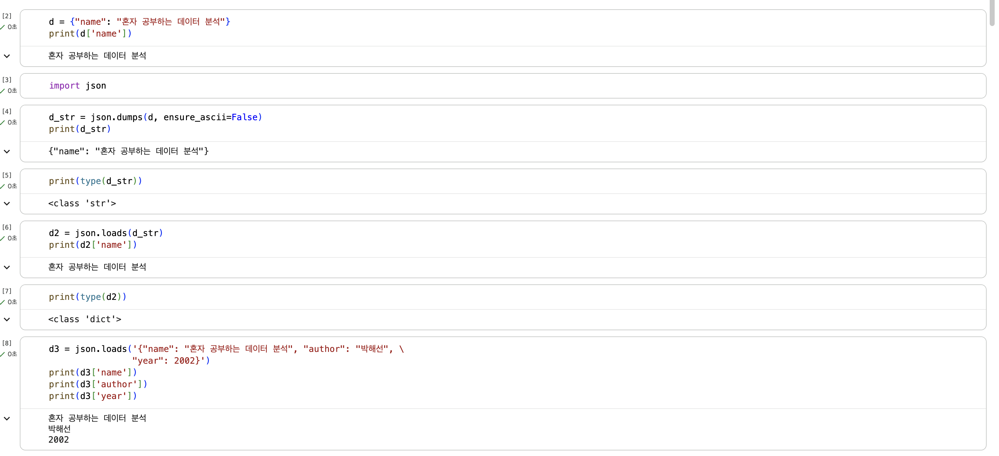
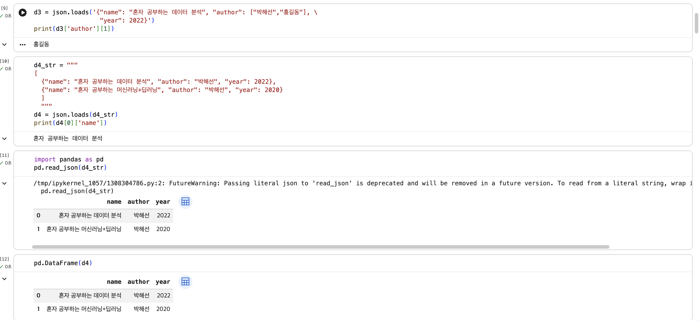
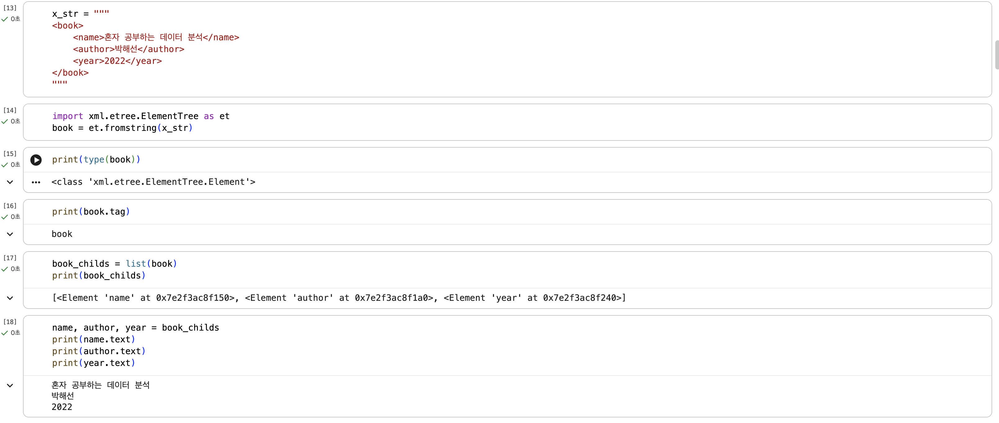
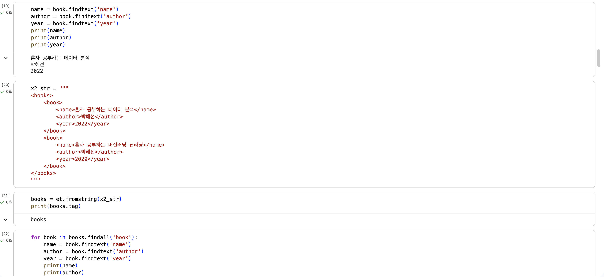
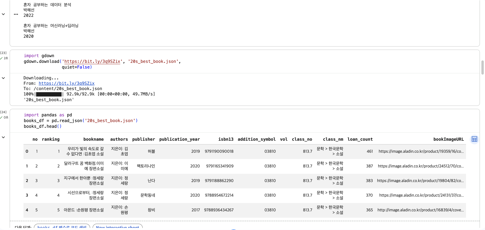
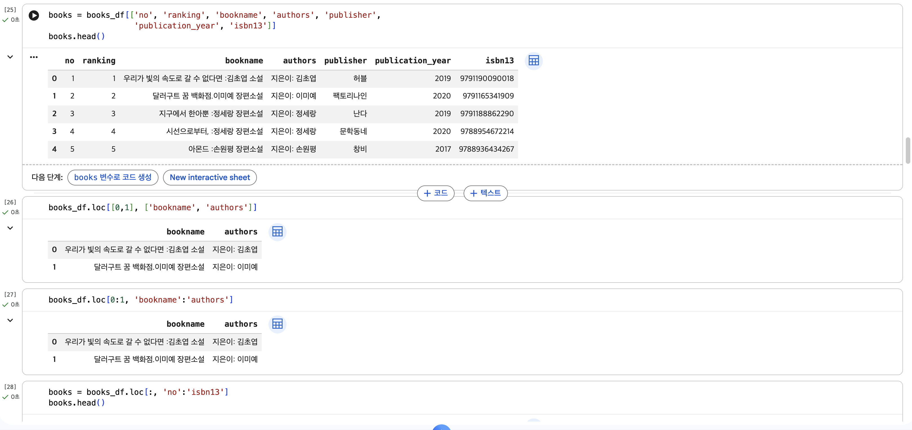

# 데이터분석 2주차 정규과제

📌데이터분석 정규과제는 매주 정해진 분량의 『*혼자 공부하는 데이터 분석 with 파이썬*』 을 읽고 학습하는 것입니다. 이번 주는 아래의 **DataAnalysis_2nd_TIL**에 나열된 분량을 읽고 공부하시면 됩니다.

아래의 문제를 풀어보며 학습 내용을 점검하세요. 문제를 해결하는 과정에서 개념을 스스로 정리하고, 필요한 경우 제시된 강의를 참고하여 보완하는 것이 좋습니다.

<!-- 강의 링크는 아래와 같습니다.
https://www.youtube.com/watch?v=s_-VvTLb3gs&list=PLVsNizTWUw7FGzSRCkQrPEEe-ljVXgS7k&index=4
https://www.youtube.com/watch?v=Il6L8OtNFpc&list=PLVsNizTWUw7FGzSRCkQrPEEe-ljVXgS7k&index=5
-->


## DataAnalysis_2nd_TIL

### 2장 데이터 수집하기
#### 01. API 사용하기
#### 02. 웹 스크래핑 사용하기


## Study Schedule

| 주차  | 공부 범위     | 완료 여부 |
| ----- | ------------- | --------- |
| 1주차 | p.24~81    | ✅         |
| 2주차 | p.84~151   | ✅         |
| 3주차 | p.154~219  | 🍽️         |
| 4주차 | p.222~279 | 🍽️         |
| 5주차 | p.282~325 | 🍽️         |
| 6주차 | p.328~379 | 🍽️         |
| 7주차 | p.382~430 | 🍽️         |

<br>

<!-- 여기까진 그대로 둬 주세요-->


# 1️⃣ 개념 정리 

## 01. API 사용하기
### API
- 인증된 URL만 있으면 언제든지 필요한 데이터에 편리하게 접근할 수 있는 방식
- 두 프로그램이 서로 대화하기 위한 방법을 정의한 것

#### 웹 페이지를 전송하기 위한 통신 규약 : HTTP
- 인터넷에서 웹 페이지를 전송하는 기본 통신 방법
- HTTP 프로토콜을 사용해 API를 만드는 것 => 웹 기반 API

#### 웹 페이지 문서 : HTML
- 웹 브라우저가 화면에 표시할 수 있는 문서의 한 종류이자 웹 페이지를 위한 표준 언어
- 마크업 언어

#### 웹 기반 API 
- 웹 브라우저가 웹 서버의 웹 페이지를 요청하여 보여주는 방식과 비슷
- 주로 CSV, JSON, XML 형태로 데이터 전달(보통 JSON이나 XML 많이 사용)
##### JSON 
- 파이썬의 딕셔너리와 리스트를 중첩해 놓은 것과 비슷
- 키와 값을 콜론(:)으로 연결 / 키와 값에 문자열을 쓰는 경우 큰따옴표("")로 감싸기
- 파이썬 객체를 JSON 문자열로 변환 : json.dumps() 함수 (웹 기반 API로 데이터 전달 시 텍스트로 전달. HTTP 프로토콜이 텍스트 기반이기 때문)
- JSON 문자열을 파이썬 객체로 변환 : json.loads() 함수 (JSON 문자열 파이썬 프로그램에 사용 시 파이썬 딕셔너리로 변환)
- JSON 문자열을 데이터프레임으로 변환 : read_json() 함수
##### XML
- 엘리먼트들이 계층 구조를 이루면서 정보 표현
- XML 문자열을 파이썬 객체로 변환 : fromstring() 함수
- 자식 엘리먼트 확인 : findtext() 메서드
- 여러 개의 자식 엘리먼트 확인 : final() 메서드와 for 문
- XML을 데이터프레임으로 변환 : read_xml() 함수 

## 02.웹 스크래핑 사용하기
### 도서 쪽수를 찾아서 
- 도서 검색 결과 가져오기 : requests.get() -> 검색 결과에서 도서 상세 페이지로 연결되는 링크 URL 추출 -> 다시 requests.get()으로 도서 상세 페이지 가져오기 -> 도서 상세 페이지에서 쪽수 추출
- 데이터프레임 행과 열 선택하기 : loc 메서드
- 검색 결과 페이지 HTML 가져오기 : requests.get() 함수

### HTML에서 데이터 추출하기 : 뷰티플수프(스크래핑 패키지도 자주 쓰이지만 코랩에 설치되어 있지 않음) 
- 크롬 개발자 도구로 HTML 태그 찾기 : 검사 선택 -> 개발자 도구 창 메뉴 바 Select 클릭 -> 이름 위 마우스 커서
- 태그 위치 찾기 : fine() 메서드 : 첫 번째 매개변수에 찾을 태그 이름 지정, attires 매개변수에 찾으려는 태그의 속성을 딕셔너리로 지정
- 도서 상세 페이지 HTML 가져오기 : requests() 함수 (원하는 책의 상세 페이지 )
- 테이블 태그를 리스트로 가져오기 : find_all() 메서드
- 태그 안의 텍스트 가져오기 : get_text() 메서드

### 전체 도서의 쪽수 구하기 
- 데이터프레임 행 혹은 열에 함수 적용하기 : apply() 메서드
- 데이터프레임과 시리즈 합치기 : merge() 함수

## 웹 스크래핑할 때 주의할 점
- 웹사이트에서 스크래핑을 허락하였는지 확인하기
- HTML 태그를 특정할 수 있는지 확인하기

## merge() 함수의 매개변수 
- on 매개변수 : 합칠 떄 기준이 되는 열을 지정 (이 열은 두 데이터프레임에 모두 존재해야 함)
- how 매개변수 : 합쳐질 방식을 지정 (기본값은 inner / how 매개변수 생략 시 두 데이터프레임의 값이 같은 행만 합침)
- - left인 경우 : 첫 번째 데이터프레임을 기준으로 합침.
  - right인 경우 : 두 번째 데이터프레임을 기준으로 합침.
  - outer인 경우 : 두 데이터프레임의 모든 행을 유지하면서 합침.
- left_on과 right_on 매개변수 : 합칠 기준 되는 열의 이름이 서로 다를 경우 이 매개변수를 사용해서 각기 지정 가능.
- left_index와 right_index 매개변수 : 합칠 기준이 열이 아니라 인덱스일 경우 이 변수들을 사용해서 인덱스 지정 가능. 
<!-- 새롭게 배운 내용을 자유롭게 정리해주세요.-->


# 2️⃣ 수행 인증

<!-- 교재에서 안내된 과정을 직접 실행해본 뒤, 진행 결과가 보이도록 4~6장의 스크린샷을 캡처하여 아래에 첨부해주세요.-->








<br>
<br>

# 3️⃣ 확인 문제

## 문제 1.

> **🧚Q. 다음 중 BeautifulSoup 외에 웹 스크래핑에 사용할 수 있는 파이썬 패키지로 가장 적절한 것은 무엇인가요?**

```
1️⃣ NumPy  
2️⃣ Scrapy  
3️⃣ Matplotlib  
4️⃣ Scikit-learn  
```

```
2번. Numpy는 수치 계산, Matplotlib는 데이터 시각화, 그리고 Scikit-learn은 머신러닝에 주로 활용되는 파이썬 도구이지만, Scrapy는 파이썬에서 웹 페이지의 데이터를 자동으로 수집하고 크롤링할 수 있도록 만들어진 도구이기 때문입니다. 
```


### 🎉 수고하셨습니다.
