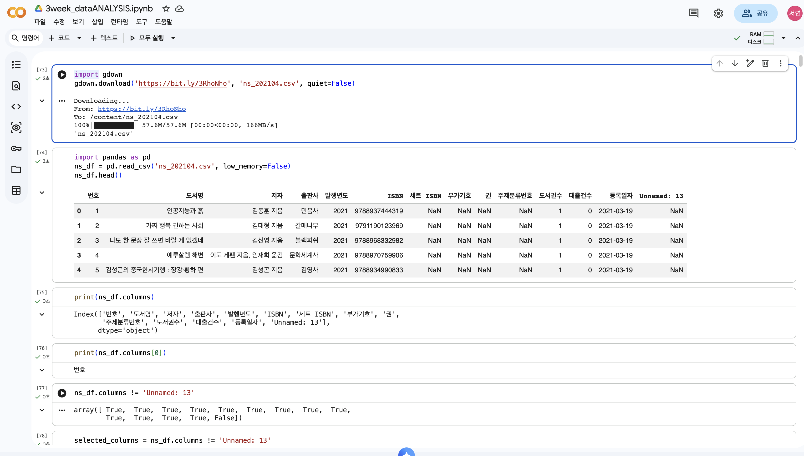
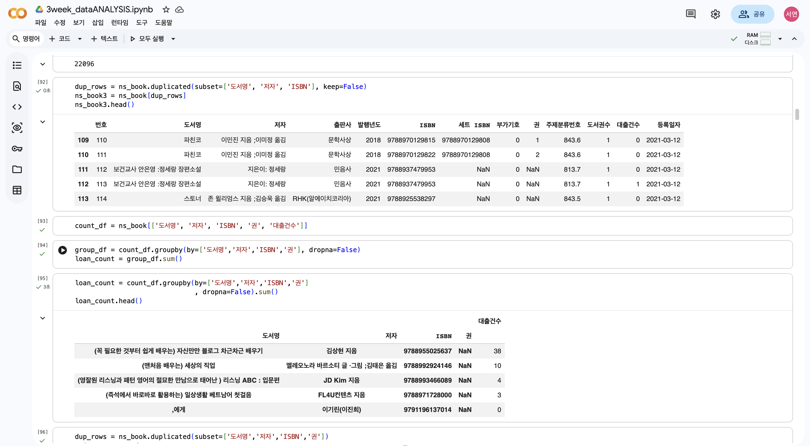
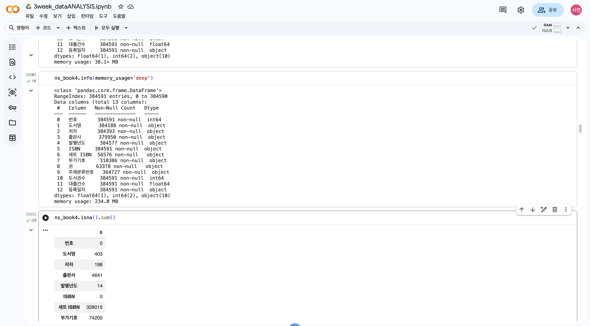
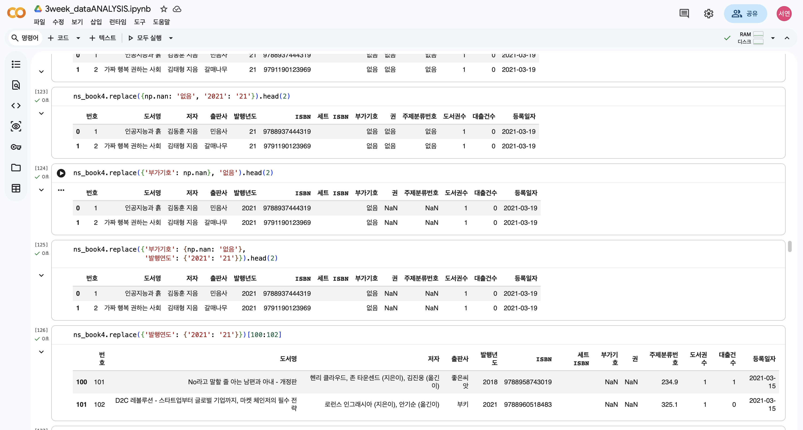
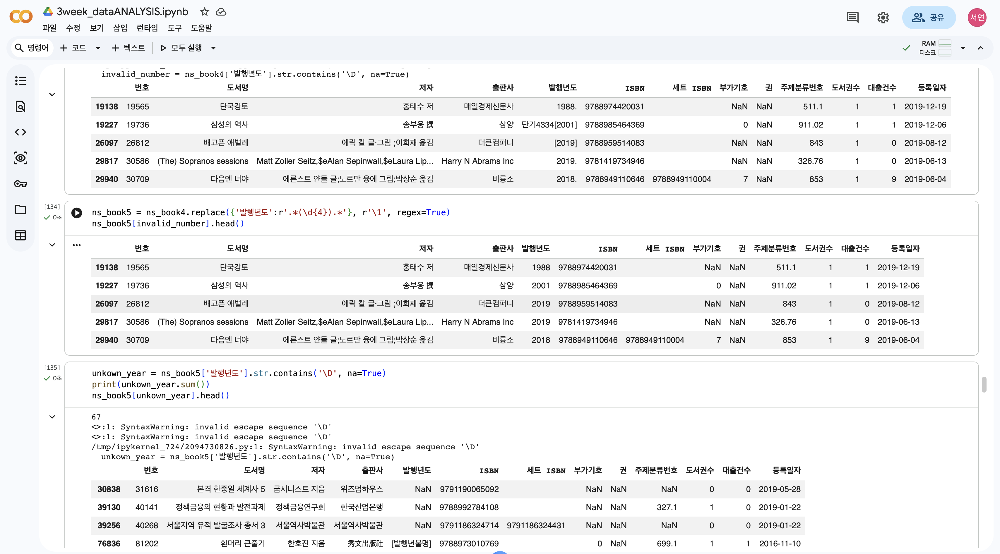
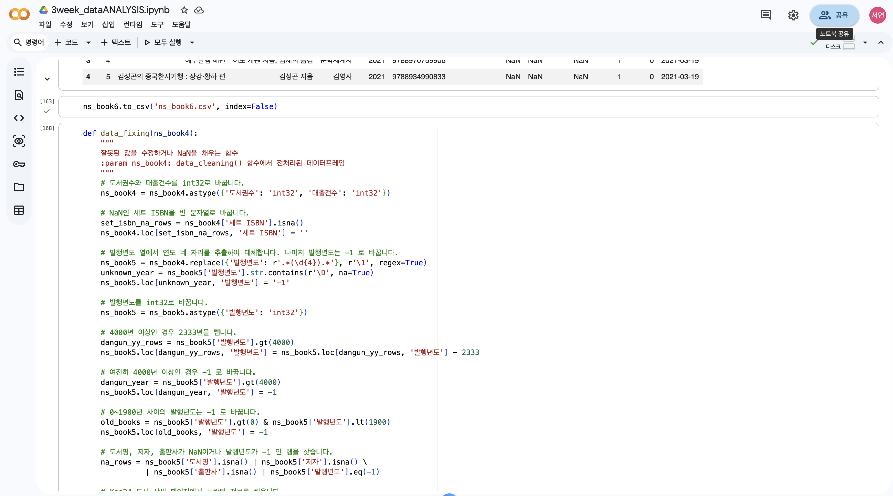
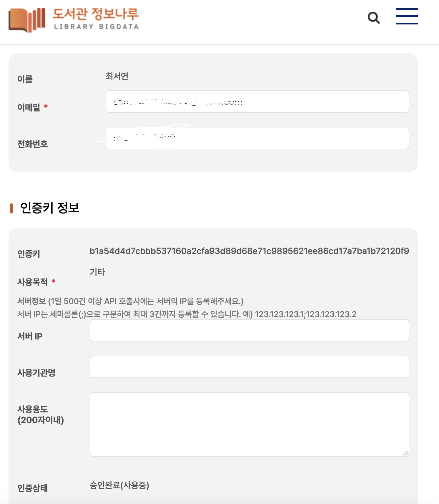

# 데이터분석 3주차 정규과제

📌데이터분석 정규과제는 매주 정해진 분량의 『*혼자 공부하는 데이터 분석 with 파이썬*』 을 읽고 학습하는 것입니다. 이번 주는 아래의 **DataAnalysis_3rd_TIL**에 나열된 분량을 읽고 공부하시면 됩니다.

아래의 문제를 풀어보며 학습 내용을 점검하세요. 문제를 해결하는 과정에서 개념을 스스로 정리하고, 필요한 경우 제시된 강의를 참고하여 보완하는 것이 좋습니다.

<!-- 강의 링크는 아래와 같습니다.
https://www.youtube.com/watch?v=CE3_InvbmLY&list=PLVsNizTWUw7FGzSRCkQrPEEe-ljVXgS7k&index=6
https://www.youtube.com/watch?v=hhbzUEQWdTg&list=PLVsNizTWUw7FGzSRCkQrPEEe-ljVXgS7k&index=7
-->


## DataAnalysis_3rd_TIL

### 3장 데이터 정제하기
#### 01. 불필요한 데이터 삭제하기
#### 02. 잘못된 데이터 수정하기


## Study Schedule

| 주차  | 공부 범위     | 완료 여부 |
| ----- | ------------- | --------- |
| 1주차 | p.24~81    | ✅         |
| 2주차 | p.84~151   | ✅         |
| 3주차 | p.154~219  | ✅         |
| 4주차 | p.222~279 | 🍽️         |
| 5주차 | p.282~325 | 🍽️         |
| 6주차 | p.328~379 | 🍽️         |
| 7주차 | p.382~430 | 🍽️         |

<br>

<!-- 여기까진 그대로 둬 주세요-->


# 1️⃣ 개념 정리 

## 01. 불필요한 데이터 삭제하기
### 데이터 정제 
- 데이터에서 손상되거나 부정확한 부분을 수정하고, 불필요한 데이터를 삭제하거나 불완전한 값을 교체하는 등의 작업
- 데이터 랭글링 / 데이터 먼징의 일부로 수행될 수 있음.

### 열 삭제하기
#### loc 메서드와 불리언 배열 
- columns 속성 = 판다스의 index 클래스 객체
- 원소별 비교 : 판다스 배열 성격의 객체는 어떤 값과 비교할 때 동으로 배열에 있는 모든 원소와 하나씩 비교. => 이를 통해 열을 불리언 배열로 나타낼 수 있음.
- != : 비교 연산자
- != 뒤에 제외하고 싶은 열의 이름 작성
#### drop() 메서드
- 데이터프레임의 행이나 열을 삭제
- 열을 삭제하는 경우 : 첫 번째 매개변수에 삭제하려는 열 이름을 전달 -> axis 매개변수를 1(삭제할 축 지정 가능)로 지정.
  - axis 기본값 - 0 : 행 삭제 / 1: 열 삭제
  - drop(['제외할 열1', '제외할 열 2'], axis=1)
- inlace 매개변수 : 선택한 데이터프레임 바로 수정 가능.
#### dropna() 메서드 
- 기본적으로 NaN이 하나 이상 포함된 행이나 열을 삭제
- 모든 값이 NaN인 열을 삭제하는 경우 : dropna(axis=1, how='all')

### 행 삭제하기
- drop() 사용 가능.
#### [] 연산자와 슬라이싱
- [] 연산자에 슬라이싱이나 불리언 배열을 전달하면 행을 선택.
- [] 연산자에 슬라이싱을 하면 마지막 인덱스를 포함하지 않음!
#### [] 연산자와 불리언 배열 
- 불리언 배열을 만든는 조건을 [] 연산자에 바로 넣음.

### 중복된 행 찾기 
- duplicated() 메서드를 사용하여 검사 가능.
- 중복된 행의 처음 행을 제외한 나머지 행 -> True / 중복되지 않은 행 -> False 로 표시한 불리언 배열 반환
- 예시 : sum(ns_book.duplicated()) (*sum : 중복된 행 개수 세기)
- 일부 열을 기준으로 중복된 행 찾기 : duplicated() 메서드 안에 subset 매개변수
- keep 매개변수 : 중복된 행을 모두 True로 표시한 불리언 배열을 반환

### 그룹별로 모으기 
- group by() 메서드 : by 매개변수에 행을 합칠 떄 기준이 되는 열 지정.
  - 해당 메서드로 데이터를 합칠 때 기본적으로 지정된 열에 NaN이 있는 행은 삭제.

### 원본 데이터 업데이트하기 
- (1) duplicated() 메서드로 중복된 행을 True로 표시한 불리언 배열을 만들기
- (2) 1번에서 구한 불리언 배열을 반전시켜서 중복되지 않은 고유한 행을 True로 표시
    - 불리언 배열 반전 시, ~ 연산자 사용. 
- (3) 2번에서 구한 불리언 배열을 사용해 원본 배열에서 고유한 행만 선택
- (4) copy() 메서드로 새로운 데이터 프레임 만들기
#### 원본 데이터프레임 인덱스 설정하기 
- set_index() 메서드 : 지정한 열을 인덱스로 설정하는 경우
#### 업데이트하기 : update() 메서드
- update() 메서드 : 다른 데이터프레임 사용해 원본 데이터프레임의 값을 업데이트하는 경우
- reset_index() 메서드 : 데이터프레임 인덱스 재설정하는 경우
- 열의 순서를 바꾸는 방법 : [] 연산자에 원하는 열 이름을 순서대로 전달.

### 일괄 처리 함수 만들기 
#### 일괄 처리 함수
- deat_cleaning() : 불필요한 행과 열을 제거하기 위해 작성했던 코드를 새로운 데이터에 적용하기 쉽도록 일괄 처리하는 함수 
<!-- 새롭게 배운 내용을 자유롭게 정리해주세요.-->

## 02. 잘못된 데이터 수정하기
### 데이터프레임 정보 요약 요약하기 
- info() 메서드 : 데이터프레임 정보를 요약해서 출력.
    - info() 메소드는 메모리 사용량을 추정하기 때문에 정확한 메모리 사용량을 얻으려면 memory_usage 매개벼눗에 'deep옵션'을 지정.

### 누락된 값 처리하기 
#### 누락된 값 개수 확인하기 : isna() 메서드 
- isna() 메서드 : 각 행이 비어 있는지를 나타내는 불리언 배열은 반환
#### 누락된 값으로 표시하기 : None과 np.nan
- 정수를 지정하는 열에 None을 입력하면 누락된 값으로 인식.
- astype() 메서드 : 데이터 타입 지정하는 경우
- np.nan : none에서 NaN으로 표시하고 싶은 경우(판다스는 NaN이라는 값을 따로 가지고 있지 않기 대문에 넘파이 패키지에 있는 np.nan 사용.) 
#### 누락된 값 바꾸기(1) : loc, fillna() 메서드
- loc 메서드 : 누락된 값을 원하는 값으로 바꿀 수 있음.
- fillna() 메서드 : 원하는 값을 전달하여 NaN으로 대체할 수 있는 함수
#### 누락된 값 바꾸기(2) : replace() 메서드
- replace() 메서드 : NaN을 포함한 어떤 값도 바꿀 수 있는 함수
- 바꾸려는 값이 하나인 경우 : replace(원래 값, 새로운 값) 
- 바꾸려는 값이 여려 개인 경우 : replace([원래 값1, 원래 값2], [새로운 값1, 새로운 값2])
- 열 마다 다른 값으로 바꾸는 경우 : replace({열 이름: 원래 값}, 새로운 값)

### 정규 표현식
- 문자열 패턴을 찾아서 대체하기 위한 규칙의 모음
#### 숫자 찾기 : \d
#### 문자 찾기 : 마침표(.)
- 어떤 문자에도 대응
- *문자 : 0개 이상 반복되는 것을 표시
- 역슬래시(\) : 일반 문자라고 인식하게 하기 위함. (\s : 공백 문자)
#### 잘못된 값 바꾸기
- contains() : 정규 표현식을 사용하면 특정 문자열을 포함하는지 확인 가능.
- gt() 메서드 : 전달된 값보다 큰 값 찾음.
#### 누락된 정보 채우기


<!-- 새롭게 배운 내용을 자유롭게 정리해주세요.-->


# 2️⃣ 수행 인증

<!-- 교재에서 안내된 과정을 직접 실행해본 뒤, 진행 결과가 보이도록 4~6장의 스크린샷을 캡처하여 아래에 첨부해주세요.-->







<!-- 이번 주차에는 API를 발급받는 과정도 포함하여 첨부해주세요.-->



<br>
<br>

# 3️⃣ 확인 문제

## 문제 1.

> **🧚Q. 다음 두 데이터프레임 df1, df2를 합쳐서 데이터프레임 df3를 만들려고 합니다.**  
> 적절한 판다스 명령을 선택해주세요.

<table>
<tr>

<td>

### df1

| index | col1 | col2 |
|-------|------|------|
| 0     | x    | 5    |
| 1     | y    | 6    |
| 2     | z    | 7    |

</td>

<td>

### df2

| index | col3 | col4 |
|-------|------|------|
| 0     | x    | 50   |
| 1     | y    | 60   |
| 2     | w    | 70   |

</td>

<td align="center" valign="middle">

<h2> ➜ </h2>

</td>

<td>

### df3 (결과)

| index | col1 | col2 | col3 | col4 |
|-------|------|------|------|------|
| 0     | x    | 5.0  | x    | 50.0 |
| 1     | y    | 6.0  | y    | 60.0 |
| 2     | z    | 7.0  | NaN  | NaN  |
| 3     | NaN  | NaN  | w    | 70.0 |

</td>

</tr>
</table>

```
1️⃣ pd.merge(df1, df2)
2️⃣ pd.merge(df1, df2, how='left')
3️⃣ pd.merge(df1, df2, left_on='col1', right_on='col3', how='outer')
4️⃣ pd.merge(df1, df2, left_on='col1', right_on='col3', how='inner')
```

```
여기에 선택한 답과 그 이유를 간단히 서술해주세요!
- 3번.
- 이유 : df1에서는 col1duf, df2에서는 col3 열의 값을 기준으로 두 데이터프레임을 비교해 맞추었기 때문에 병합 기준 열을 left_on='col1', right_on='col3'과 같이 지정하고, 양쪽 데이터프레임에 공통적으로 존재하는 값만 아니라 한쪽에만 존재하는 값까지 모두 포함해야 하므로 how='outer'이 작성되어 있는 3번이 정답이다.  
```


### 🎉 수고하셨습니다.
